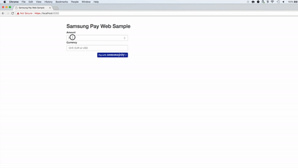

# Samsung Pay Web Sample App
Sample project that shows how to integrate Samsung Pay with Datatrans

## Getting started

Samsung Pay allows merchants to collect payments through their payment platform that connects the Samsung Pay wallet and lets users authenticate through their mobile device. It enables merchants to receive
encrypted payment information which can be forwarded to their Payment Processor for authorization. This Guide is intended for merchants who would like to integrate Samsung Pay with Datatrans. For more Information on Samsung Pay visit: http://www.samsung.com/ch/samsung-pay/

### Samsung Pay Flow 

The SamsungPay solution is made out of two APIs. The first one is just a WebSDK to trigger the payments on the web. The second one is a REST-like server-to-server API. The application/ message flow is as follows:
1. At first the user clicks on the merchants pay button. 
2. The merchant has then to create a transaction on the Samsung system. This
call returns the encryption data required to pass on to the WebSDK.
3. The encryption data is then passed on to the SamsungPayWebSDK, which handles connecting to the users device. 
4. The user is presented with a login screen for his Samsung account. As soon as he enters his email address or phone number and
submits a push notification is sent to all devices linked with the Samsung account. This part is handled all by the Samsung infrastructure.
5. The user then accepts the payment request on his mobile device.
6. As soon as the user accepts the payment request, Samsungs servers verify and then invoke the callback url (defined in step 2) with a
referenceId.
7. The merchant gets the payment credentials from Samsung by calling the SamsungPay API with the reference ID 
8. The merchant sends the payment credentials to Datatrans for authorization. 
9. The merchant notifies Samsung if the transaction succeeded.
10. The merchant shows a confirmation screen.


### Prerequisites

#### Samsung Pay related
1. Samsung Pay dev-account
2. Samsung Pay service-ID
3. Samsung Pay enabled device
4. A list of IP addresses/ ranges you want to be whitelisted by Samsung to access their systems. (Developers NAT, DEV Server,
   Production Server)

#### Datatrans related
1. Datatrans merchant ID (Get one [here](https://www.datatrans.ch/))
2. Merchant needs to be configured to make XML-calls
3. Merchant needs to be enabled for Samsung Pay

#### General
1. Java installed on your local dev system
2. Maven installed on your local dev system
3. openssl installed on your dev system
3. Your preferred browser
5. Some basic experience with Spring Boot
6. Some basic understanding of Samsung Pay


### Samsung Pay Merchant Setup

Please note that these steps are required to use the sample application as well as if you want to use Samsung Pay in your productive environment.
These steps require your to get in touch with Samsung.

#### Signing up for a SamsungPay dev account 

Navigate to [https://us-partner.pay.samsung.com/](https://us-partner.pay.samsung.com/) and sign up. You can use this account later on for testing on your Samsung device.

#### Obtaining the Samsungpay service-ID

To make sure only you can decrypt the messages coming from Samsung you need to submit a self signed CSR for each Environment. The CSR should have following attributes:

    - File extension CSR
    - RSA Key Size 2048 bit or higher
    - Signature Algorithm: Sha256WithRSAEncryption
    
**Create one CSR for your Test and Production environment**


Furthermore you need to submit your list of IP addresses to Samsung during the onboarding process. Please get in touch for more information.
Submit each CSR to Samsung. After verifying your account, the IP addresses and your CSRs you will be given a service-ID and access to their Documentation

##### How to generate a CSR

**Generate your private key**
```bash
openssl genrsa -out domain.com.key 2048
```
**Generate the CSR with your private key**
```bash
openssl req -out CSR.csr -key domain.com.key -new -sha256
```

**Verify your CSR**
```bash
 openssl req -in CSR.csr -noout -text
```

### Sample Application


The sample application is a spring boot application ( https://projects.spring.io/spring-boot/) that can be run out of the box. It uses an embedded tomcat.


#### Installing

1. Clone the repository
 ```zsh
    $ git clone git@github.com:datatrans/samsungpay-web-sample.git
    $ cd samsungpay-web-sample
```
2. Open it with your favorite IDE / text editor
3. Install the project
```
mvn clean install
```

#### Converting your private key

To decrypt the payment credentials sent by Samsung you need to use your private key in DER format. Here is how you convert it.

```bash
     openssl pkcs8 -topk8 -in domain.com.key -outform DER -nocrypt -out rsapriv.der
```
Do this for each private key in each environment. Copy the file to `src/main/resources`

#### Adjusting the properties

Property | Description | File
---|---|---
server.port | The port the server should be running on | application.properties
callbackUrl| The callback Samsung uses. Make sure this is aligned with your server port | application.properties
merchant.name | Your company's name. | application.properties
merchant.reference |This is used by Samsung to display transactions in the SamsungPay App | application.properties
samsung.serviceId | Your ServiceID given by Samsung |application-dev.properties / application-prod.properties
datatrans.merchantId | Your datatrans merchantId | application-dev.properties / application-prod.properties
datatrans.sign | The sign belonging to the merchantId |application-dev.properties / application-prod.properties

## Testing

1. Open the URL you defined in your browser
2. Fill the inputs and tap/click "Pay with SamsungPay"
4. Log in with your Samsung dev-account
5. Confirm the transaction your device
5. Result is displayed



During contact with Samsung you will be provided with a sample Samsung Pay app. The app will contain test cards, those will not be charged by Datatrans but will be replaced
if a valid Samsung Pay token is sent as follows:

If 

cardno=4242 4242 4242 4242
expm=12
expy=18


### Authorization with Datatrans
Check out `src/main/java/ch/datatrans/examples/samsungpay/client/DatatransClient.java` to see how the authorization is done.

Sample request:

```XML
<?xml version="1.0" encoding="UTF-8" ?>
<authorizationService version="1">
  <body merchantId="$merchantId">
    <transaction refno="$refno">
      <request>
        <samsungPayData><![CDATA[$token]]></samsungPayData>
        <reqtype>NOA</reqtype>
        <transtype>05</transtype>
        <sign>$sign</sign>
      </request>
    </transaction>
  </body>
</authorizationService>
```

Sample response:

```XML
<?xml version="1.0" encoding="UTF-8" ?>
<authorizationService version="1">
  <body merchantId="$merchantId" status="accepted">
    <transaction refno="$refno" trxStatus="response">
      <request>
        <samsungPayData><![CDATA[$token]]></samsungPayData>
        <reqtype>NOA</reqtype>
        <transtype>05</transtype>
        <sign>$sign</sign>
      </request>
      <response>
        <responseCode>01</responseCode>
        <responseMessage>Authorized</responseMessage>
        <uppTransactionId>160823101329060450</uppTrasactionId>
        <authorizationCode>538050451</authorizationCode>
        <acqAuthorizationCode>101538</acqAuthorizationCode>
        <aliasCC>70119122433810042</aliasCC>
        <expy>18</expy>
        <expm>12</expm>
      </response>
    </transaction>
  </body>
</authorizationService>
```

A successful call will return `<body>`’s attribute `status="accepted"` and `<transaction>`’s `trxStatus="response"` as 
well as a new `<response>` element containing the responseCode. A responseCode equal to "01" or "02" indicates
an authorized transaction. Elements aliasCC, expy and expm will be returned only if the merchant uses credit card aliases.

## Remarks
- This is sample code! Never ever use this code in production! 
- If you have questions please raise an issues and add the label "question".


## Appendix 
[Datatrans APIs](https://www.datatrans.ch/en/technology_apis/technical-documentation)

## Built With

* [Spring Boot ](https://projects.spring.io/spring-boot/) 
* [Maven](https://maven.apache.org/) 
